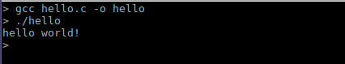
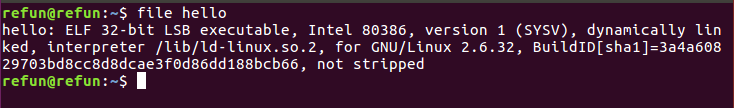
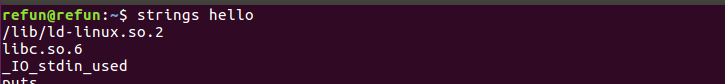
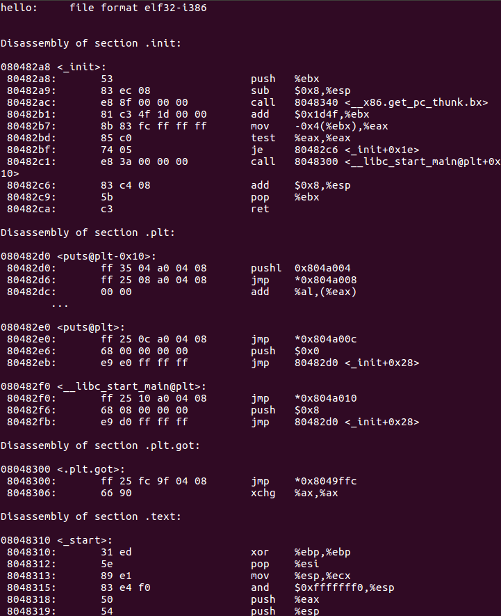

# Linux İşletim Sistemi Üzerinde Tersine Mühendislik #TAMAMLANMADI#

Bu yazı, [Reverse Engineering a Linux executable – hello world](https://www.codementor.io/packt/reverse-engineering-a-linux-executable-hello-world-rjceryk5d) adresinin Türkçe diline çevirisini içermektedir. Hatalar veya katkı için iletişime geçebilirsiniz. Yazıda anlatılanlara hakim olmak için temel seviyede Linux işletim sistemi kullanımı ve C programlama dili bilgisi gerekmektedir.

Başlamak için küçük bir program yazacağız. Ama başlamadan önce bize gerekli araçların sistemimizde yüklü olduklarından emin olmamız gerek. Bir terminal açın ve aşağıdaki kodu girin. Bu kod ile sistemimize eğer yüklü değilse GCC derleyici araç takımını kurmuş olacağız. Eğer önceden yüklemişseniz, zaten kurulu olduğunu söyleyen bir yanıt alacaksanız. Tabi bu komutu çalıştırabilmek için yönetici izinlerine sahip olmalısınız. 

```bash
sudo apt install gcc
```

Derleyicimizi yükledikten sonra şu küçük programı *hello.c* adında bir dosyaya kaydedin.

```c
#include <stdio.h>
void main(void)
{
    printf ("hello world!\n");
}
```

Programı derleyip, çalıştırmak için aşağıda gördüğünüz komutları girin:


Linux programımız ekrana bir mesaj iletip çalışmasını sonlandıracaktır.

##  dlroW olleH
Bir programa tersine-mühendislik uygulamadan önce dosyamız hakkında bilgi almak iyi olur. _file_ komutu ile başlayalım:


Komut çıktısında, programımızın 32-bit ELF dosyası olduğunu öğrendik. ELF dosyaları, Linux sistemlerdeki yerel çalıştırılabilir dosya biçimidir. Yani Linux 'un kendi çalıştırılabilir dosya formatı.

Bir sonraki adımda, programımız içersinde geçen _karakter katarları(strings)_ hakkında bilgi alalım. Gerekli komut aşağıda:


Komut çıktımız aşağıdaki gibi olacaktır(versiyon bilgilerinde farklılıklar olabilir):
```bash
/lib/ld-linux.so.2
libc.so.6
_ IO_stdin_used
puts
__ libc_start_main
__ gmon_start__
GLIBC_2.0
PTRh
UWVS
t$,U
[^_ ]
hello world!
;* 2$"(
GCC: (Ubuntu 5.4.0-6ubuntu1~16.04.10) 5.4.0 20160609
crtstuff.c
__ JCR_LIST__
deregister_tm_clones
__ do_global_dtors_aux
completed.7209
__ do_global_dtors_aux_fini_array_entry
frame_dummy
__ frame_dummy_init_array_entry
hello.c
__ FRAME_END__
__ JCR_END__
__ init_array_end
_ DYNAMIC
__ init_array_start
__ GNU_EH_FRAME_HDR
_GLOBAL_OFFSET_TABLE_
__ libc_csu_fini
_ ITM_deregisterTMCloneTable
__ x86.get_pc_thunk.bx
_ edata
__ data_start
puts@@GLIBC_2.0
__ gmon_start__
__ dso_handle
_ IO_stdin_used
__ libc_start_main@@GLIBC_2.0
__ libc_csu_init
_ fp_hw
__ bss_start
main
_ Jv_RegisterClasses
__ TMC_END__
_ ITM_registerTMCloneTable
.symtab
.strtab
.shstrtab
.interp
.note.ABI-tag
.note.gnu.build-id
.gnu.hash
.dynsym
.dynstr
.gnu.version
.gnu.version_r
.rel.dyn
.rel.plt
.init
.plt.got
.text
.fini
.rodata
.eh_frame_hdr
.eh_frame
.init_array
.fini_array
.jcr
.dynamic
.got.plt
.data
.bss
.comment
```
Karakter katarları, dosyanın başından itibaren sırası ile listelendiler. Listenin başlarında, bizim programımız içerisinde ekrana yazdırdığımız mesajı ve derleyici hakkında bazı bilgileri görebilirsiniz. En baştaki ilk iki satır, programın kullandığı kütüphane dosyasını işaret ediyor.

```bash
/lib/ld-linux.so.2
libc.so.6
```

Listenin son kısımları ise dosya içerisindeki bölümlerin isimlerini gösteriyor. Yukarıdaki tüm liste içerisine biz sadece birkaç bilgi ekledik. Geri kalan tüm satırlar, derleyici tarafından otomatik olarak eklendi.

Linux üzerinde tersine-mühendislik işlemleri bir komut uzağımızda. `objdump` komutunu `-d` parametresi ile kullandığımızda, terminal ekranımız çalıştırılabilir dosyamızın _assembly_ komutları ile dolacaktır (_assembly_ hakkında geniş bilgi almak için arama motorlarını kullanarak internet üzerinde bir gezintiye çıkabilirsiniz). Eğer sonuçları bir dosyaya kaydedip detaylı bir şekilde incelemek isterseniz şöyle yapabilirsiniz:

```bash
objdump -d hello > hello_disassembly.asm
```

_hello_disassembly.asm_ dosyasının içeriği aşağıdaki gibi görünecektir:


Dosyada görülen _assembly_ yazım biçimi AT&T biçimidir. INTEL yazım biçimi için şu komut işinizi görecektir:
```bash
objdump -M intel -d hello > hello_disassembly.asm
```

Sonuç, program içerisindeki her bir fonksiyonun kodunu göstermektedir. Kısaca, programımızn çalıştırılabilir bölümünde yaklaşık 15 adet fonksiyon bulunmakta.

```bash
Disassembly of section .init:
080482a8 <_ init>:

Disassembly of section .plt:
080482d0 <puts@plt-0x10>:
080482e0 <puts@plt>:
080482f0 <__libc_start_main@plt>:

Disassembly of section .plt.got:
08048300 <.plt.got>:

Disassembly of section .text:
08048310 <_ start>:
08048340 <__ x86.get_pc_thunk.bx>:
08048350 <deregister_tm_clones>:
08048380 <register_tm_clones>:
080483c0 <__ do_global_dtors_aux>:
080483e0 <frame_dummy>:
0804840b <main>:
08048440 <__libc_csu_init>:
080484a0 <__libc_csu_fini>:

Disassembly of section .fini:
080484a4 <_ fini>:
```

Kodun tersine çevrilmiş hali genellikle `.text` bölümünde bulunmaktadır.

Kodu incelerken GCC derleyicisi tarafından üretilmiş ve şimdilik sadece işlemciyi ilgilendiren bölümü geçip bizi asıl ilgilendiren `main` fonksiyonumuza gelelim. 
